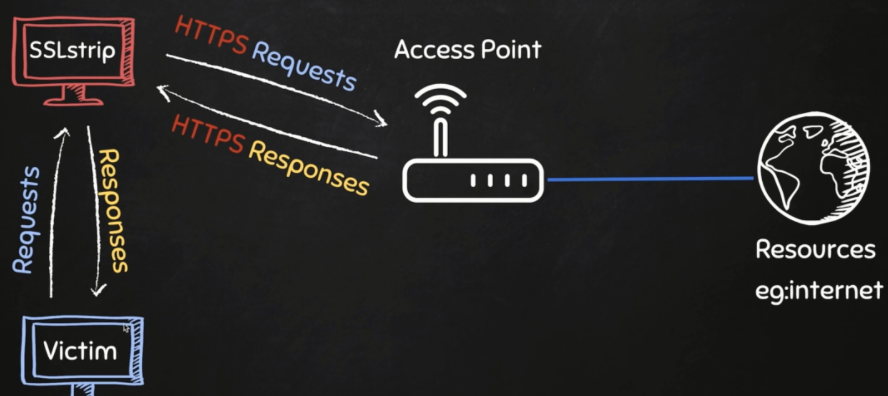

# SSLStrip

## Conecpt


## Commands
- delete all routes: ```iptables --flush```
- start: ```sslstrip```
- listen to port 10000 & redirect to port 80: ```iptables -t nat -A PREROUTING -p tcp --destination-port 80 -j REDIRECT --to-port 10000```
